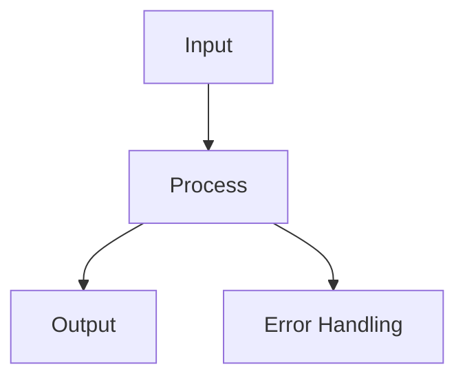

## When to Use
Build documentation sites: mkdocs, docusaurus, diagrams-as-code, versioned docs.

## MkDocs Setup
```yaml
# mkdocs.yml
site_name: My Project
theme:
  name: material
  palette:
    scheme: dark
    primary: teal
nav:
  - Home: index.md
  - Guide: guide.md
  - API: api.md

markdown_extensions:
  - pymdownx.highlight
  - pymdownx.superfences
  - admonition
```

```bash
pip install mkdocs-material
mkdocs serve    # Local dev
mkdocs build    # Static site
mkdocs gh-deploy  # Deploy to GitHub Pages
```

## Mermaid Diagrams
```markdown

```

## Pitfalls
- **Versioning**: Use mike for docs versioning
- **Broken links**: Use link checker in CI
- **Search**: Material theme includes search by default

## Verification
- Build and preview locally
- Check all links work
- Verify search functionality
- Test on mobile viewport